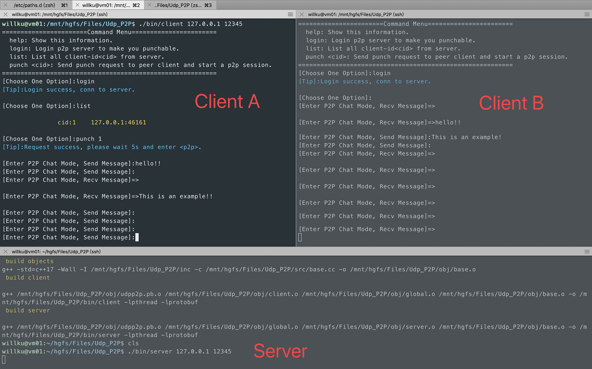
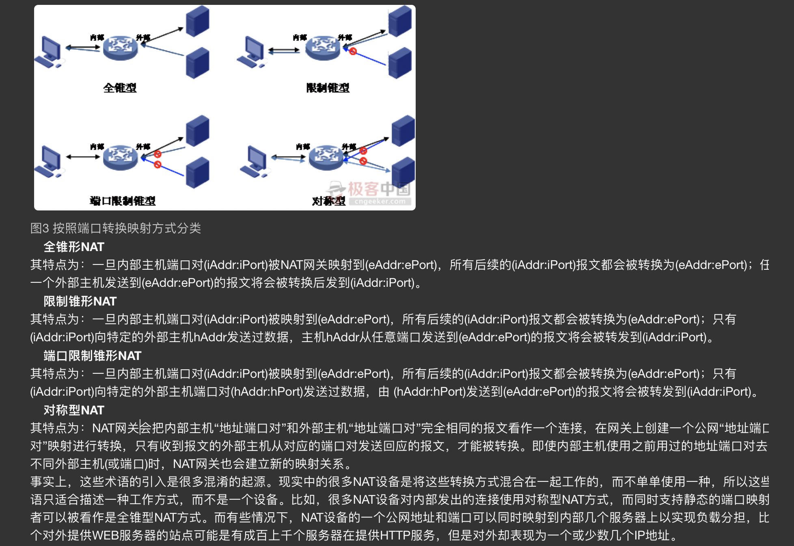
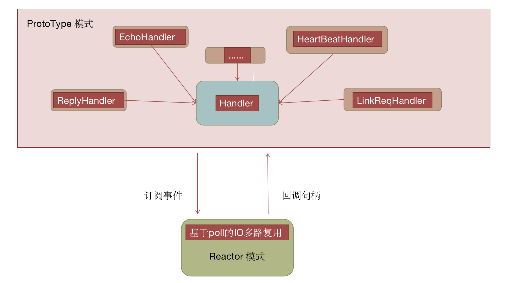

# Udp_P2P
[TOC]

### 穿透演示

### 安装使用

>1、依赖Google Protobuf 序列化、反序列化二进制协议，使得通信过程理解更加清晰。(通信协议在本仓库dep目录下)
>
>请自行编译安装https://github.com/protocolbuffers/protobuf
>
>2、编译器支持C++ 17 (由于用到c++的一些新的特性：constexper、自定义常量表达式等)
>
>3、make clean && make
>
>4、启动Server：./bin/server 127.0.0.1 12345
>
>5、启动Client A、B：./bin/client 127.0.0.1 12345
>
>[注]：程序经测试可以实现公网的内网穿透。即将Server部署在公网，双Client为NAT后。

### 原理详述

- P2P技术的相关详细思路请参考如下网站
  - [P2P技术详解(一)：NAT详解——详细原理、P2P简介](http://www.52im.net/thread-50-1-1.html)
  - [P2P技术详解(二)：P2P中的NAT穿越(打洞)方案详解](http://www.52im.net/thread-542-1-1.html)
  - [P2P技术详解(三)：P2P技术之STUN、TURN、ICE详解](http://www.52im.net/thread-557-1-1.html)

### 概括理解

- 首先NAT的分类有如下几种

  >NAT设备的类型对于TCP穿越NAT,有着十分重要的影响,根据端口映射方式,NAT可分为如下4类,前3种NAT类型可统称为cone类型。
  >
  >(1)全克隆( Full Clone) : NAT把所有来自相同内部IP地址和端口的请求映射到相同的外部IP地址和端口。任何一个外部主机均可通过该映射发送IP包到该内部主机。
  >
  >(2)限制性克隆(Restricted Clone) : NAT把所有来自相同内部IP地址和端口的请求映射到相同的外部IP地址和端口。但是,只有当内部主机先给IP地址为X的外部主机发送IP包,该外部主机才能向该内部主机发送IP包。
  >
  >(3)端口限制性克隆( Port Restricted Clone) :端口限制性克隆与限制性克隆类似,只是多了端口号的限制,即只有内部主机先向IP地址为X,端口号为P的外部主机发送1个IP包,该外部主机才能够把源端口号为P的IP包发送给该内部主机。
  >
  >(4)对称式NAT ( Symmetric NAT) :这种类型的NAT与上述3种类型的不同,在于当同一内部主机使用相同的端口与不同地址的外部主机进行通信时, NAT对该内部主机的映射会有所不同。对称式NAT不保证所有会话中的私有地址和公开IP之间绑定的一致性。相反,它为每个新的会话分配一个新的端口号。

- XX Clone型NAT打洞概况来说就是这张图

  

- 步骤描述

  >先假设：有一个服务器S在公网上有一个IP，两个私网分别由NAT-A和NAT-B连接到公网，NAT-A后面有一台客户端A，NAT-B后面有一台客户端B，现在，我们需要借助S将A和B建立直接的TCP连接，即由B向A打一个洞，让A可以沿这个洞直接连接到B主机，就好像NAT-B不存在一样。
  >
  >实现过程如下：
  >
  >1、 S启动两个网络侦听，一个叫【主连接】侦听，一个叫【协助打洞】的侦听。
  >
  >2、 A和B分别与S的【主连接】保持联系。
  >
  >3、 当A需要和B建立直接的TCP连接时，首先连接S的【协助打洞】端口，并发送协助连接申请。同时在该端口号上启动侦听。注意由于要在相同的网络终端上绑定到不同的套接字上，所以必须为这些套接字设置 SO_REUSEADDR 属性（即允许重用），否则侦听会失败。
  >
  >4、 S的【协助打洞】连接收到A的申请后通过【主连接】通知B，并将A经过NAT-A转换后的公网IP地址和端口等信息告诉B。
  >
  >5、 B收到S的连接通知后首先与S的【协助打洞】端口连接，随便发送一些数据后立即断开，这样做的目的是让S能知道B经过NAT-B转换后的公网IP和端口号。
  >
  >6、 B尝试与A的经过NAT-A转换后的公网IP地址和端口进行connect，根据不同的路由器会有不同的结果，有些路由器在这个操作就能建立连接，大多数路由器对于不请自到的SYN请求包直接丢弃而导致connect失败，但NAT-A会纪录此次连接的源地址和端口号，为接下来真正的连接做好了准备，这就是所谓的打洞，即B向A打了一个洞，下次A就能直接连接到B刚才使用的端口号了。
  >
  >7、 客户端B打洞的同时在相同的端口上启动侦听。B在一切准备就绪以后通过与S的【主连接】回复消息“我已经准备好”，S在收到以后将B经过NAT-B转换后的公网IP和端口号告诉给A。
  >
  >8、 A收到S回复的B的公网IP和端口号等信息以后，开始连接到B公网IP和端口号，由于在步骤6中B曾经尝试连接过A的公网IP地址和端口，NAT-A纪录了此次连接的信息，所以当A主动连接B时，NAT-B会认为是合法的SYN数据，并允许通过，从而直接的TCP连接建立起来了。

- 难点分析

  >1、穿透实验的关键在于A\B发送给对方公网的消息是异步的，双方尽量同时发送才能提高成功率，所以在双方发送打洞包尽量启用线程同时发送。并且在通信过程中不能终止，hold住连接。
  >
  >2、整个过程用代码实现需要有清晰的协议设计、设计模式，否则容易乱，而且代码冗余性、扩展性不强。

### 设计思想

#### 需求分析

- 分析Server需要的模块
  - 网络通信模块：需要时刻关注socket是否可读(from client's request)、可写（srever's response）
  - 事件处理模块：解析client request的报文后需要回调**多个"订阅(注册)"该事件**相关的Handler
- 分析Client需要的模块
  - 网络通信模块：需要时刻关注socket是否可读(from srever's response、peer client's request)、可写（srever's response，other client's request/response）
  - 事件处理模块：解析response/request的报文后需要回调**多个"订阅(注册)"该事件**相关的Handler
  - 菜单交互模块：单独使用一个线程。本程序是console、可以封装为QT的交互
  - P2P打洞模块：单独使用一个线程。双方同时开启线程打洞，大大提升成功率

#### 设计模式

- 分析

> 1、网络通信模式使用Reactor半个设计模式（只关注socket可读读事件，因为udp的sendto本身不阻塞也是异步的）
>
> 2、事件处理模块：prototype 的设计模式，让Handler们自动向上注册至基类
>
> 3、关联网络通信模式-事件处理模块：网络模块解析出消息type后，回调订阅了该type的handlers

- 图示

  
